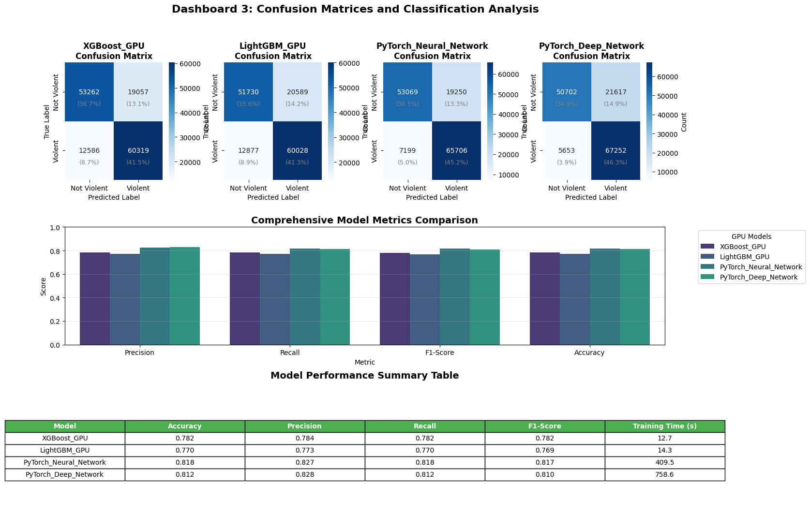
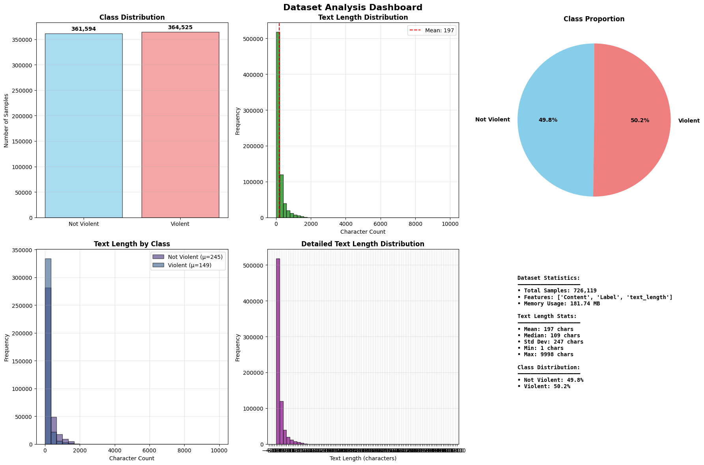

# Violence Detection in Text Using BERT-based Analysis

### A Comprehensive Report on Hate Speech Classification

This repository contains the code and analysis for the "Violence Detection in Text" project, originally completed for a Social Media Computing course. The project implements a full machine learning pipeline to classify text as violent or non-violent, leveraging modern NLP techniques and GPU acceleration for efficient processing.




---

## 📖 Table of Contents

- [Key Features](#-key-features)
- [Project Pipeline](#-project-pipeline)
- [Results & Analysis](#-results--analysis)
- [Setup and Installation](#-setup-and-installation)
- [Usage](#-usage)
- [Future Work](#-future-work)
- [Authors](#-authors)

---

## ✨ Key Features

- **End-to-End NLP Pipeline**: Covers everything from data loading and EDA to advanced model training and evaluation.
- **BERT-based Feature Engineering**: Uses **DistilBERT**, a lighter and faster version of BERT, to generate powerful contextual text embeddings.
- **GPU-Accelerated Model Training**: Implements and compares several high-performance classifiers that leverage GPU capabilities, including:
  - **XGBoost (GPU)**
  - **LightGBM (GPU)**
  - **PyTorch Neural Networks** (including a standard and a deep architecture).
- **In-Depth Exploratory Data Analysis (EDA)**: Provides a thorough understanding of the dataset's characteristics, including class balance, text length distribution, and content patterns.
- **Advanced Linguistic Analysis**: Goes beyond simple classification with:
  - **Opinion Mining**: Extracts opinion words and their targets using spaCy's dependency parsing.
  - **Aspect-Based Sentiment Analysis (ABSA)**: Identifies sentiment towards specific entities within the text using the Transformers library.
- **Comprehensive Visualization**: Generates insightful dashboards to compare model performance, efficiency, and classification results through confusion matrices and metrics tables.

---

## 🛠️ Project Pipeline

The project follows a structured methodology to ensure robust and reproducible results:

1.  **Environment & GPU Setup**: Verifies the computational environment and configures GPU usage for accelerated processing.
2.  **Data Loading & EDA**: Loads the `HateSpeechDatasetBalanced.csv` and performs a comprehensive exploratory data analysis to understand its structure, quality, and statistical properties.

3.  **Data Preprocessing**: Cleans and standardizes the text data by converting to lowercase, removing URLs and special characters, and lemmatizing words.
4.  **Feature Engineering with DistilBERT**: Generates 768-dimensional contextual embeddings for the training and test sets using a pre-trained DistilBERT model.
5.  **GPU-Accelerated Model Training**: Trains and evaluates multiple classifiers on the BERT embeddings, including XGBoost, LightGBM, and two custom-built PyTorch neural networks.
6.  **Evaluation & Visualization**: Compares model performance using metrics like F1-score, accuracy, precision, recall, and training time. Results are presented in a series of focused dashboards.

---

## 📊 Results & Analysis

The analysis compares the performance of four powerful GPU-accelerated models. The **PyTorch Neural Network** emerged as the top-performing model for this task, achieving the best balance of precision and recall.

-   **Best F1-Score**: **0.817** (PyTorch Neural Network)
-   **Highest Accuracy**: **0.818** (PyTorch Neural Network)
-   **Highest Precision**: **0.828** (PyTorch Deep Network)
-   **Fastest Training Time**: **XGBoost (GPU)** at just 12.7 seconds.

The project dashboards provide a detailed visual breakdown of these results, including confusion matrices and efficiency scores (F1-score per second of training).


_Dashboard showing training time and efficiency analysis._

---

## ⚙️ Setup and Installation

To run this project locally, please follow these steps. A CUDA-enabled GPU is highly recommended for the model training cells.

**1. Clone the Repository**

```bash
git clone https://github.com/your-username/your-repository-name.git
cd your-repository-name
```

**2. Create a Virtual Environment**

It's recommended to use a virtual environment to manage dependencies.

```bash
# Using venv
python -m venv venv
source venv/bin/activate  # On Windows, use `venv\Scripts\activate`

# Or using Conda
conda create -n violence-detection python=3.10
conda activate violence-detection
```

**3. Install Required Libraries**

A `requirements.txt` file is provided for easy installation.

```bash
pip install -r requirements.txt
```
*(If a `requirements.txt` file is not available, you can create one with the following content or install the libraries manually.)*
```
# requirements.txt
pandas
numpy
scikit-learn
torch
transformers
spacy
xgboost
lightgbm
wordcloud
matplotlib
seaborn
nltk
jupyter
ipywidgets
```

**4. Download NLP Models and Data**

The notebook automatically downloads the necessary models from spaCy and NLTK. You may need to run the corresponding cells if you haven't used them before.

**5. Place the Dataset**

Download the `HateSpeechDatasetBalanced.csv` and place it in the root directory of the project.

---

## 🚀 Usage

1.  **Launch Jupyter Notebook or JupyterLab**:
    ```bash
    jupyter lab
    ```
2.  **Open the Notebook**: Navigate to and open `SentAnalysisFinal.ipynb`.
3.  **Run the Cells**: Execute the cells sequentially. The notebook is structured to follow the project pipeline.
    -   **Note**: The advanced analysis cell that runs Opinion Mining and ABSA on the full dataset (`Cell 12`) is computationally intensive and may take a long time to run. It saves its results to CSV files (`full_dataset_opinion_targets.csv` and `full_dataset_absa_results.csv`) and can be skipped if you only wish to train the models.
    -   The BERT embedding generation and model training cells are also resource-heavy and will perform best with a GPU.

---

## 🔮 Future Work

This project provides a strong foundation for text-based violence detection. Future work could expand upon this in several key areas:

-   **Model Enhancement**:
    -   **Fine-Tuning**: Instead of just using pre-trained embeddings, fine-tuning a full BERT or RoBERTa model on the specific hate speech dataset could yield higher accuracy.
    -   **Ensemble Methods**: Combining the predictions of the top-performing models (e.g., PyTorch NN and XGBoost) could create a more robust and generalized classifier.

-   **Feature Engineering**:
    -   **Hybrid Features**: Augment BERT embeddings with traditional NLP features like TF-IDF, sentiment scores, or LIWC (Linguistic Inquiry and Word Count) categories to capture different linguistic signals.

-   **Dataset and Scope**:
    -   **Larger & Diverse Datasets**: Training on a wider variety of datasets from different platforms (e.g., Twitter, Reddit, Facebook) could improve the model's ability to generalize.
    -   **Multi-lingual Support**: Adapting the pipeline to detect violence and hate speech in other languages using multilingual BERT models.

-   **Deployment and Explainability**:
    -   **Real-time API**: Deploying the best model as a REST API for real-time content moderation.
    -   **Explainable AI (XAI)**: Integrating tools like LIME or SHAP to understand *why* the model classifies a piece of text as violent, providing transparency and helping to identify model biases.

---

## 👥 Authors

-   **Hamza Khaled Mahmoud Ahmed**
-   **Soultan Toure Salifou**
-   **Maher Balchi**
```
